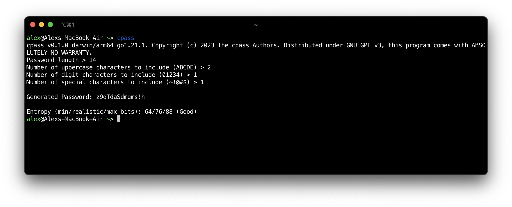

# cpass

A minimalist CLI random password generator focusing on convenience and security.



# ⭐ Features

## Convenience

`cpass` generates passwords the way you would do it for your own convenience.

When generating a password, `cpass` takes a random lowercase string as a base and then applies modifications like making some letters uppercase, adding digits, or adding special characters.

## Security

`cpass` is coded with a security-first mindset. Upon generating the password, `cpass` will provide you with a security report containing minimum and maximum entropy bits, and the average of both being the realistic strength of the password.

- **Minimum entropy** bits assume that the attacker knows that you used this utility specifically while also knowing the exact parameters you supplied.
- **Maximum entropy** bits also imply that the attacker is aware of you using this utility, but in this case, it is assumed that the attacker supposes that you used random parameters.
- ***Realistic* entropy** is the average between both. However, if the attacker doesn't know that this specific utility was used to generate the password, the absolute entropy is going to be higher.

# 🔒 Security Considerations
## Parameter Choice

Please do not copy someone's parameters or reuse existing ones. It's vital to ensure that the parameters are not easy to guess to maximize the security.

# 💿 Installation

## Using Go's `go install`
Assuming that you have an existing Go installation, you should be able to access the `go install` command which will build the project from source and put it to `$GOPATH/bin` directory. By default, `$GOPATH` is `$HOME/go`.

You can run the following command to build and install `cpass`:
```sh
go install github.com/AlexSSD7/cpass@latest
```

After that, you should be able to run `cpass`, or `~/go/bin/cpass` if you have not added `~/go/bin` to `$PATH`.

## Package managers

TODO.

## Prebuilt binaries

You can find prebuilt binaries in [cpass GitHub Releases](https://github.com/AlexSSD7/cpass/releases).

## Build from Source
Clone the repository using `git` and run `go build` to build the `cpass` binary.

```sh
git clone https://github.com/AlexSSD7/cpass
cd cpass
go build
```

# 🔧 Usage

Using `cpass` is as easy as starting it up. `cpass` is fully interactive, meaning that there are no command line options to worry about.

Upon the startup, you will be asked to supply the parameters to use when generating the password. Here is an example of how everything is going to look like:
```
user@pc:~$ cpass
cpass v0.1.0 linux/amd64 go1.21.2. Copyright (c) 2023 The cpass Authors. Distributed under GNU GPL v3, this program comes with ABSOLUTELY NO WARRANTY.
Password length > 14
Number of uppercase characters to include (ABCDE) > 2 
Number of digit characters to include (01234) > 1
Number of special characters to include (~!@#$) > 1

Generated Password: wrfbajIwy!8Cdy

Entropy (min/realistic/max bits): 64/76/88 (Good)
user@pc:~$
```

# ©️ Copyright and License

Copyright (c) 2023 The cpass Authors.

Provided under the GNU General Public License v3. The copy of the license is included in the LICENSE file.

Use this `git` command to view the list of cpass Authors:
```sh
git log --format='%aN <%aE>' | sort -uf
```